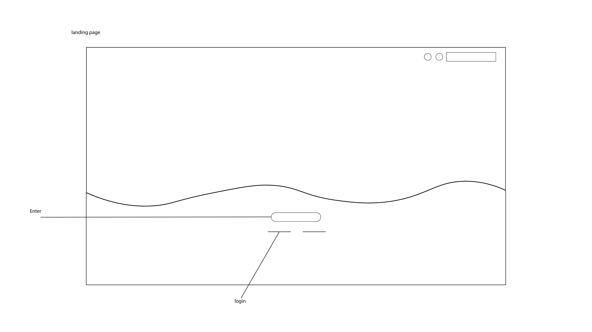
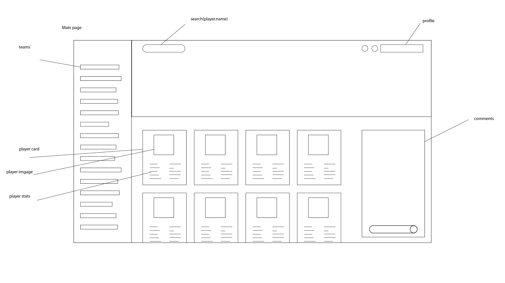
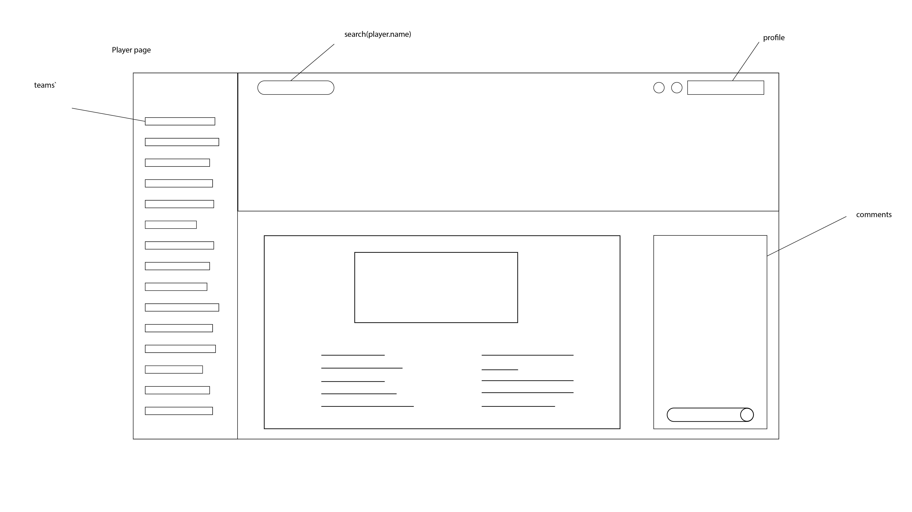

# <strong> Hello and Welcome </strong>
<strong> This is my PROJECT THREE for the SEIR Program. </strong>

Have a look around, I hope you enjoy.

Thank you, 
Vernell Miller

 

# <strong> Team Builder </strong>

Calling all sports Fanatics. Your time has come. Use your knowlege of the game, create your players and build your favorite teams.

# Technologies Used:

    - HTML
    - CSS
    - JavaScript
    - Mongo DB
    - Express
    - React
    - Node JS
    - LUCIDAPP
    - Adobe Illustrator
    

# Screenshots:

<strong> WIREFRAME </strong>

# Getting Started:

[Click here](https://sports-team-builder.netlify.app/) to see the deployed project.

# Future Enhancements :
- Show name or image of team after clicking on team.
- Delete or edit created player.
- restrict certain functionalities for non registered users.